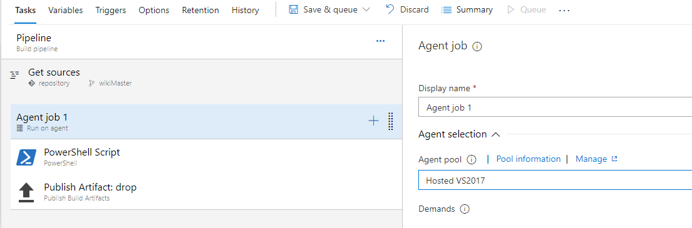
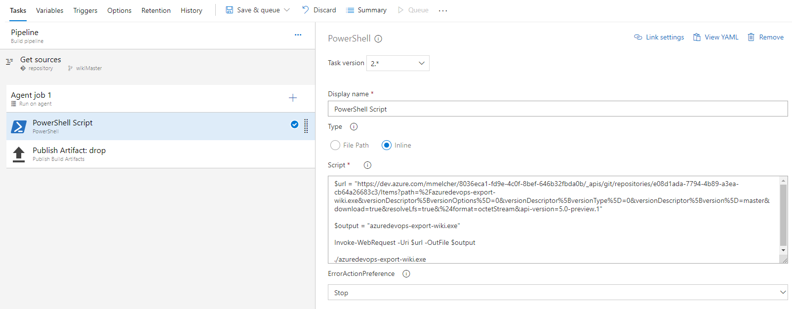
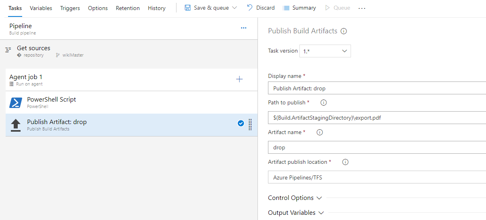

# Build Task

Please use the [Azure DevOps Extension](https://marketplace.visualstudio.com/items?itemName=richardfennellBM.BM-VSTS-WikiPDFExport-Tasks) by @rfennell if possible.

Using Azure DevOps WikiPDFExport as build task is straightforward.

1. Create a new build definition
2. Git Source is "Other Git"
3. Add the clone url to the wiki to the details and username / password if required
4. Ensure that the agent is a windows agent
5. Add a powershell task with the following code:

    ```bash
    # Download url to the export tool
    # Update the url to the latest version!!!
    $url = "https://github.com/BenjaminBrienen/AzureDevOps.WikiPDFExport/releases/download/latest/AzureDevOps.WikiPDFExport.exe"

    # filename of the tool
    $output = "AzureDevOps.WikiPDFExport.exe"

    # download the file
    Invoke-WebRequest -Uri $url -OutFile $output

    # launch the tool - adjust the parameters if required
    ./AzureDevOps.WikiPDFExport.exe
    ```

6. Add a second task to publish the PDF as build artifact.

Once the build succeeds, you can download the PDF file from the build page or use it in a release.

## Pictures

### Windows Agent



### PowerShell Task



### Publish Task


